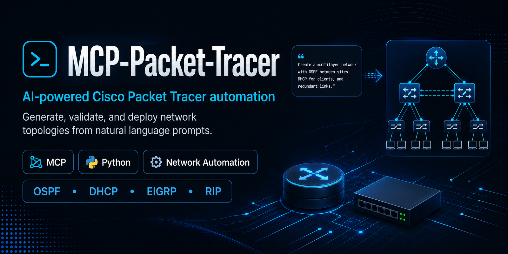
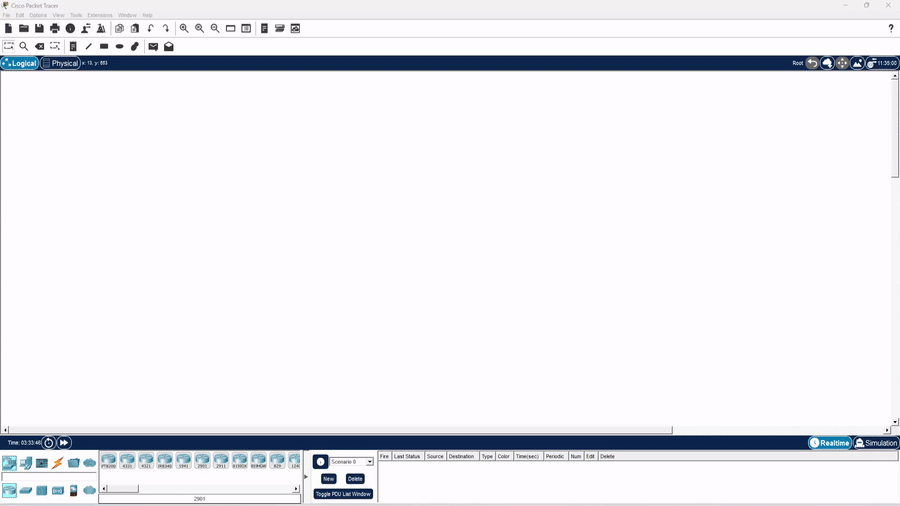

<div align="center">



**Tell your AI _"create a network with 3 routers, OSPF and DHCP"_ — it plans, validates, generates, and deploys the topology directly into Cisco Packet Tracer in real time.**

[](https://github.com/Mats2208/MCP-Packet-Tracer/releases)
[](https://python.org)
[](https://docs.pydantic.dev)
[](https://modelcontextprotocol.io)
[](https://www.mcpnetwork.top)
[](https://mats2208.github.io/MCP-Packet-Tracer/)
[](https://github.com/Mats2208/MCP-Packet-Tracer/blob/main/LICENSE)

[](https://lobehub.com/mcp/mats2208-mcp-packet-tracer)

<br/>

<table>
<tr>
<td align="center"><strong>43 MCP Tools</strong></td>
<td align="center"><strong>5 MCP Resources</strong></td>
<td align="center"><strong>74 Device Models</strong></td>
<td align="center"><strong>151 Modules</strong></td>
<td align="center"><strong>15 Cable Types</strong></td>
</tr>
</table>

**🌐 Website:** https://www.mcpnetwork.top &nbsp;•&nbsp; **📚 Documentation:** https://mats2208.github.io/MCP-Packet-Tracer/

</div>

---

## Showcase

<p align="center">
  
</p>
<p align="center"><sub>3-router linear topology with OSPF, DHCP, and 6 PCs — planned and deployed via MCP tools</sub></p>

<table>
<tr>
<td width="50%">
<p align="center"></p>
<p align="center"><sub>Full build + live deploy pipeline in VS Code</sub></p>
</td>
<td width="50%">
<p align="center"></p>
<p align="center"><sub>Auto-generated IOS CLI configs with OSPF & DHCP</sub></p>
</td>
</tr>
</table>

<p align="center">
  
</p>
<p align="center"><sub>Live deploy — from a natural-language prompt to a running topology in Packet Tracer</sub></p>

---

## What it does

A **Model Context Protocol (MCP) server** that gives any LLM (Claude, GitHub Copilot, Codex, …) full programmatic control over Cisco Packet Tracer.

| | Feature | Details |
|---|---------|---------|
| **Planning** | Natural language → topology | A single prompt becomes a complete `TopologyPlan` |
| **IP / DHCP** | Auto /24 LANs + /30 links, DHCP pools | Sequential, gateway at `.1` |
| **Routing** | Static · OSPF · EIGRP · RIP | Full IOS generation |
| **Switching** | VLANs, trunks, **inter-VLAN routing** (router-on-a-stick), STP, port-security | `.1q` subinterfaces + per-VLAN DHCP |
| **Security** | Device hardening (SSH, local users, enable-secret, banner), ACL/NAT | On live devices via the bridge |
| **IPv6** | Dual-stack addressing | Routers via CLI, hosts via SLAAC |
| **Wireless** | WiFi laptops + auto-associated Access Points | NIC swap → `Wireless0`, default-SSID assoc |
| **Validation** | Typed errors + auto-fixer | Wrong cables, missing ports, model upgrades |
| **Verification** | Plan-vs-live diff + health check | Drift, down links, duplicate IPs |
| **Deploy** | Real-time HTTP bridge to PT (auto-reconciles) | No copy-paste — commands stream directly |
| **Export** | Plans, JS scripts, CLI configs | Reusable project files on disk |

👉 Full tool reference, device catalog, networking guides and architecture live in the **[documentation site](https://mats2208.github.io/MCP-Packet-Tracer/)**.

## Installation

**1. Install the server**

```bash
git clone https://github.com/Mats2208/MCP-Packet-Tracer
cd MCP-Packet-Tracer
pip install -e .
```

**2. Connect your MCP client** (Claude Code shown)

_Linux · macOS · Git Bash · Windows `cmd.exe`:_

```bash
claude mcp add --scope user --transport stdio packet-tracer -- python -m packet_tracer_mcp --stdio
```

_Windows PowerShell_ — quote the `--` separator, or PowerShell swallows it and Claude aborts with `error: unknown option '-m'`:

```powershell
claude mcp add --scope user --transport stdio packet-tracer "--" python -m packet_tracer_mcp --stdio
```

Verify with `claude mcp list` (look for `packet-tracer … ✓ Connected`).

**3. Install the live-deploy extension** — _only if you want real-time deploy into a running Packet Tracer_

Download **`V4.0.pts`** from [**Releases**](https://github.com/Mats2208/MCP-Packet-Tracer/releases/latest), then in Packet Tracer go to **Extensions → Scripting → Configure PT Script Modules → Add…** and select it. Full walkthrough in [Live deploy](#live-deploy) below.

**4. Install the Claude Code Skill** — _recommended; makes the AI use the MCP correctly instead of guessing_

The repo ships a companion **[Agent Skill](skill/SKILL.md)** that teaches the model the exact tool
catalog, the discover→plan→validate→deploy workflow, and the precise Script-Engine API (so it never
invents method/model/port names). Install it **globally** from the repo root:

_Linux · macOS · Git Bash:_

```bash
mkdir -p ~/.claude/skills/packet-tracer && cp skill/SKILL.md ~/.claude/skills/packet-tracer/SKILL.md
```

_Windows PowerShell:_

```powershell
New-Item -ItemType Directory -Force "$HOME\.claude\skills\packet-tracer" | Out-Null; Copy-Item skill\SKILL.md "$HOME\.claude\skills\packet-tracer\SKILL.md"
```

Then run `/reload-skills` in Claude Code (or restart it) and confirm with `/skills`. Details →
**[Skill docs](https://mats2208.github.io/MCP-Packet-Tracer/skill/)**.

> Requires **Python 3.11+** (deps `mcp[cli]>=1.13`, `pydantic>=2.11` install automatically).
> Full setup for every client → **[Installation docs](https://mats2208.github.io/MCP-Packet-Tracer/installation/)**.

## Quick start

Just talk to your AI:

> *"Build a network with 2 routers, 2 switches, 4 PCs, DHCP and static routing."*

The LLM calls `pt_full_build`, which plans → validates → generates → deploys.
See the **[Quick Start guide](https://mats2208.github.io/MCP-Packet-Tracer/quickstart/)**.

## Live deploy

Stream topologies into a **running** Packet Tracer in real time. Install this repo's
own **MCP Control Center** extension once — the `.pts` from
[**Releases**](https://github.com/Mats2208/MCP-Packet-Tracer/releases/latest) — via
**Extensions → Scripting → Configure PT Script Modules → Add…**, then open
**Extensions → MCP BUILDER**. It auto-connects to the bridge — no snippet to paste.

<p align="center"></p>
<p align="center"><sub>Installing the MCP Control Center extension (V4) in Packet Tracer</sub></p>

📖 Full steps → **[Live Deploy Setup](https://mats2208.github.io/MCP-Packet-Tracer/live-deploy/)**.

## Credits & Acknowledgements

Live deploy runs through **our own Packet Tracer extension** — the **MCP Control
Center** (the `.pts` in [Releases](https://github.com/Mats2208/MCP-Packet-Tracer/releases/latest)).
Its Script-Engine helper layer was **inspired by**
**[PTBuilder](https://github.com/kimmknight/PTBuilder)** by
**Kim Knight ([@kimmknight](https://github.com/kimmknight))**, who pioneered driving
Packet Tracer's Script Engine from JavaScript — thanks for the groundwork. 🙏

> PTBuilder and Packet Tracer MCP are **separate, independent projects**. You install
> *our* extension, not PTBuilder. Full
> **[Credits & Attribution](https://mats2208.github.io/MCP-Packet-Tracer/credits/)**.

## License

Released under the **[MIT License](LICENSE)** — © 2026 Mateo ([@Mats2208](https://github.com/Mats2208)).

<div align="center">

**Built with [MCP](https://modelcontextprotocol.io) · Powered by [Pydantic](https://docs.pydantic.dev) · Deploys to [Cisco Packet Tracer](https://www.netacad.com/) · Script-engine logic inspired by [PTBuilder](https://github.com/kimmknight/PTBuilder)**

If this project is useful to you, star it ⭐ and share it with the community.

</div>
